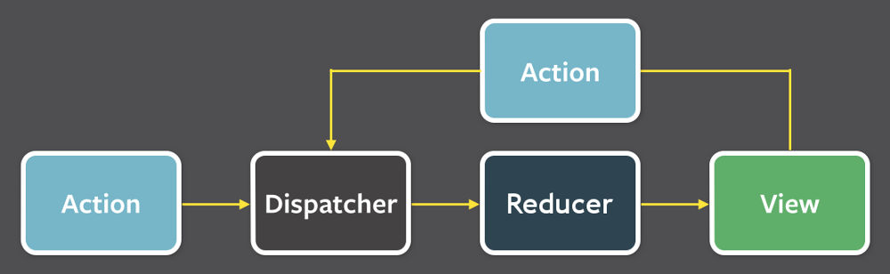

I have seen an example online that use <code>language-jsx</code> nicely. I have also found this PR <a href="https://github.com/PrismJS/prism/pull/479" class="issue-link js-issue-link" data-error-text="Failed to load issue title" data-id="54694395" data-permission-text="Issue title is private" data-url="https://github.com/PrismJS/prism/issues/479">#479</a>. However, I don't have any coloration for my jsx. Is jsx supposed to work out of the box? On the list on the site there is also <code>json</code>, but json work only with <code>js</code>.

> But wait... there's more!

 

- *The best test setup:* Automatically guarantee code quality and non-breaking
  changes. (Seen a react app with 99% test coverage before?)
- *Native web app:* Your app's new home? The home screen of your users' phones.

